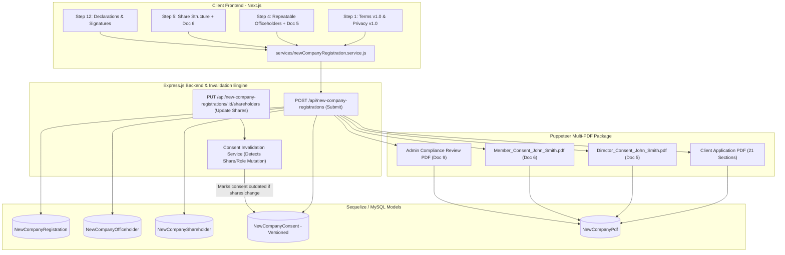

# Implementation Plan: New Australian Company Registration Backend & PDF Package (Documents 9–12)

This plan details the complete backend architecture, database schema, API routing, AML/CTF compliance review workflow, and multi-document PDF generation package for the **Australian Company Registration** module, adhering strictly to **Documents 9, 10, 11, and 12** and user business rules.

> [!IMPORTANT]
> **Zero Legacy Modification Rule**: The existing legacy `CompanyRegistration.js` model, `companyRegistration.routes.js`, and legacy tables will remain completely untouched. All new backend code will be isolated under dedicated `NewCompanyRegistration*` namespaces and mounted at `/api/new-company-registrations`.

---

## 1. Core Architectural Workflow & Document Invalidation Engine

---

## 2. Updated Database Schema (`Document 11` & Exact User Specifications)

We will create structured relational models with Sequelize in `financially-up-backend/models/`:

### 2.1 `NewCompanyRegistration` (Master Application Model)
- **Primary / Reference**: `id` (PK, AUTO_INCREMENT), `referenceNumber` (e.g. `CREG-2026-XXXXX`), `status` (`Draft`, `Submitted`, `Under Review`, `Pending Documents`, `Approved`, `Approved With Conditions`, `Declined`, `Lodged with ASIC`).
- **Document 2 Versioned Audit Fields**:
  - `terms_version` (VARCHAR, e.g. `"v1.0.0"`)
  - `terms_accepted` (BOOLEAN, `true`)
  - `terms_accepted_at` (DATETIME)
  - `terms_accepted_by` (VARCHAR, client legal name / email)
  - `terms_acceptance_method` (VARCHAR, `"Electronic Checkbox / Form Submission"`)
- **Document 3 Versioned Audit Fields**:
  - `privacy_notice_version` (VARCHAR, e.g. `"v1.0.0"`)
  - `privacy_notice_acknowledged` (BOOLEAN, `true`)
  - `privacy_notice_acknowledged_at` (DATETIME)
  - `privacy_notice_acknowledged_by` (VARCHAR, client legal name / email)
- **Step 1 (Contact & Service)**: `contactName`, `contactEmail`, `contactMobile`, `contactRelationship`, `otherRelationshipDetail`, `authorityDescription`, `primaryService`, `dateServiceRequested`, `additionalServices` (JSON), `isUrgent`, `urgencyExplanation`, `previousRefusal`, `previousRefusalDetails`.
- **Step 2 (ASIC Company Details)**: `companyName1`, `companyName2`, `companyName3`, `useAcnAsName`, `isNameReserved`, `reservationNumber`, `reservationDate`, `reservationApplicant`, `companyType`, `specialPurposeDetail`, `jurisdictionState`, `companyPurpose`, `otherPurposeDetail`, `mainBusinessActivity`, `anzsicDescription`, `tradingNameChoice`, `proposedBusinessName`, `commencementDate`, `isPartOfGroup`, `groupDescription`, `ultimateHoldingName`, `ultimateHoldingAcn`, `ultimateHoldingCountry`, `governanceDocument`, `specialInstructions`.
- **Step 3 (Addresses & Schedule C)**: `regOfficeHouseNumber`, `regOfficeStreet`, `regOfficeSuburb`, `regOfficePostcode`, `regOfficeState`, `companyOccupiesRegisteredOffice`, `occupierName`, `samePrincipalAddress`, `ppobHouseNumber`, `ppobStreet`, `ppobSuburb`, `ppobPostcode`, `ppobState`, `provideRegisteredOfficeAddress`, `providePrincipalPlaceAddress`, `addressServiceCommercialReason`, `authorisedRecipientName`, `authorisedRecipientEmail`, `authorisedRecipientPhone`.
- **Step 7 (AML/CTF CDD)**: `cddQ1` to `cddQ10` responses and detail strings.
- **Step 8 (Source of Funds/Wealth)**: `initialCapitalAmount`, `initialCapitalPaidBy`, `initialCapitalSource`, `first12MonthsFundingAmount`, `first12MonthsFundingSource`, `first12MonthsFunderName`, `first12MonthsOriginBank`, `sourceOfWealthSummary`, `hasOffshoreFunding`, `offshoreCountries`, `offshoreBanks`, `offshoreExplanation`, `hasCashOver10k`, `cashAmount`, `cashPayer`, `cashReason`.
- **Step 9 (Nominee/Trustee Arrangements)**: `isDirectorActingForOthers`, `directorNominatorName`, `isNomineeShareholder`, `nomineeNominator`, `nomineeBeneficialOwner`, `isTrusteeInvolved`, `trustName`, `trustSettlor`, `hasLegalAdvice`, `legalAdviserName`, `legalAdviceSummary`.
- **Step 10 (Optional Services)**: `abnTfnRequired`, `gstRegistrationRequired`, `expectedTurnover`, `paygWithholdingRequired`, `businessNameRegistrationRequired`, `proposedTaxBusinessName`, `bankAccountAssistance`, `accountingSoftware`, `otherAccountingSoftware`, `registeredAgentSupport`.
- **Step 12 (Statutory Declarations & Execution)**: `declaration1` to `declaration6` (BOOLEAN), `signatory1Name`, `signatory1Capacity`, `signatory1Date`, `signatory1Signature` (TEXT / Data URL), `signatory2Name`, `signatory2Capacity`, `signatory2Date`, `signatory2Signature` (TEXT).
- **Audit & Snapshot**: `submittedAt`, `ipAddress`, `userAgent`, `applicationSnapshot` (JSON full snapshot).

### 2.2 Relational Child Tables
- **`NewCompanyOfficeholder` (`Document 5`)**:
  - `id`, `registrationId` (FK), `fullName`, `formerNames`, `dob`, `birthCity`, `birthState`, `birthCountry`, `residentialAddress`, `email`, `mobile`, `occupation`, `citizenship`, `taxResidence`, `isAustralianResidentDirector`, `directorIdStatus`, `directorIdNumber`, `idDocType`, `idDocNumber`, `idDocFilePath`, `pepStatus`, `sanctionsDeclaration`, `sourceOfWealth`, `consentAccepted` (BOOLEAN), `signatureData` (TEXT), `signatureDate`.
- **`NewCompanyShareholder` (`Document 6`)**:
  - `id`, `registrationId` (FK), `fullName`, `memberType`, `address`, `shareClass`, `numberOfShares`, `amountPaidPerShare`, `amountUnpaidPerShare`, `isBeneficiallyHeld`, `heldForWhom`, `corporateOwnershipChain`, `extractFilePath`, `consentAccepted` (BOOLEAN).
- **`NewCompanyConsent` (Universal Versioned Consent & Invalidation Engine)**:
  - `id`, `registrationId` (FK), `personType` (`Officeholder` / `Member` / `ScheduleC_Recipient`), `personId` (FK to Officeholder/Shareholder), `personName`, `consentType` (`DirectorConsent_Doc5`, `MemberConsent_Doc6`, `AddressService_Doc7`, `Nominee_Doc8`), `consentVersion` (e.g. `"v1.0"`), `status` (`Active`, `Outdated`, `Superseded`, `Revoked`), `snapshotData` (JSON of the exact terms, shares, or roles consented to), `consentDataHash` (SHA-256 hash of shareholding/role parameters), `signedAt`, `signatureData`, `ipAddress`.
- **`NewCompanyBeneficialOwner`**: `id`, `registrationId` (FK), `fullName`, `dob`, `address`, `ownershipPercentage`, `holdingType`, `howControlIsHeld`.
- **`NewCompanyDocument`**: `id`, `registrationId` (FK), `documentType`, `fileName`, `filePath`, `fileSize`, `mimeType`, `status` (`Attached`, `To Follow`, `Verified`, `Rejected`).
- **`NewCompanyAdminReview` (`Document 9`)**: `id`, `registrationId` (FK), `reviewerName`, `reviewStatus`, `overallRiskRating`, `pepSanctionsScreeningResult`, `cddVerificationNotes`, `addressServiceApproval`, `decisionNotes`, `approvalConditions`, `reviewedAt`.
- **`NewCompanyPdf` (`Document 10`)**: `id`, `registrationId` (FK), `type` (`ClientApplication`, `AdminReview`, `DirectorConsent`, `MemberConsent`), `fileName`, `filePath`, `version`, `generatedBy`, `generatedAt`.
- **`NewCompanyAuditLog`**: `id`, `registrationId` (FK), `action`, `performedBy`, `details` (JSON), `ipAddress`, `createdAt`.

---

## 3. Dynamic Consent Invalidation Rule Implementation (`Document 6` & `Document 5`)

To strictly enforce the legal rule:
> *"If the client changes: 100 Ordinary Shares to: 500 Ordinary Shares after the consent was generated, the consent should become outdated and the system should require a new consent."*

We will implement `services/consentValidation.service.js`:
1. When a Member/Shareholder consent is created, we compute a `consentDataHash = sha256({ shareClass, numberOfShares, amountPaidPerShare, amountUnpaidPerShare, memberType })` and save it to `NewCompanyConsent`.
2. Whenever draft shareholder details or officeholder details are updated:
   - The service compares the new parameters against `consentDataHash`.
   - If changed: `NewCompanyConsent.update({ status: 'Outdated' }, { where: { personId, status: 'Active' } })`.
   - Flags `requiresNewConsent = true` on the member/application record.
   - Prevents final submission or ASIC lodgement until the updated consent is re-acknowledged/signed!

---

## 4. Multi-PDF Package Generation Specification (`Document 10`)

The PDF generation engine in `services/newCompanyPdf.service.js` will generate the following PDF assets using Puppeteer:

### 4.1 Master Client Application PDF (`[Ref]_Client_Application.pdf`)
Contains the 21 mandatory sections in exact order:
1. **Cover Page**: Financially Up branding, Application Reference, Proposed Company Name, Submission Timestamp.
2. **Document Control & Audit Header**:
   - `Terms of Engagement accepted: Version 1.0, [Timestamp] by [Client Name]`
   - `Privacy Collection Notice acknowledged: Version 1.0, [Timestamp] by [Client Name]`
3. **Sections 1–12 Structured Tables**: Complete rendering of all client responses with Australian date formats (`DD/MM/YYYY`).
4. **Schedule A (Officeholders) & Schedule B (Shareholders) Dynamic Tables**.
5. **Schedule C (Address Facility) & Schedule D (Nominee Structure) Declarations**.
6. **Step 12 Statutory Declarations (1 to 6) & Signatories 1 & 2 Embedded Signatures**.
7. **Complete Legal Appendices**: Full verbatim text of Terms of Engagement, Privacy Notice, Address Terms, Nominee Terms.

### 4.2 Individual Standalone Consent PDFs
- **Director / Secretary Consents (`Document 5`)**:
  - `Director_Consent_[FirstName]_[LastName].pdf` (e.g. `Director_Consent_John_Smith.pdf`)
  - Generates a standalone legal Section 201D/204C consent certificate for every proposed director and secretary.
- **Member / Shareholder Consents (`Document 6`)**:
  - `Member_Consent_[FirstName]_[LastName_or_Entity].pdf` (e.g. `Member_Consent_Acme_Holdings.pdf`)
  - Generates a standalone Section 231 share subscription consent certificate for each member.

### 4.3 Admin Compliance Review PDF (`Document 9`)
- `[Ref]_Admin_Compliance_Review.pdf`
- Internal compliance review package with AML risk scoring, PEP/sanctions check notes, UBO review, and Tax Agent sign-off.

---

## 5. API Endpoints Contract (`Document 12`)

Mounted at `/api/new-company-registrations` in `financially-up-backend/routes/newCompanyRegistration.routes.js`:

| Method | Endpoint | Description | Multer Support |
| :--- | :--- | :--- | :--- |
| `POST` | `/api/new-company-registrations` | Public client submission of complete 12-step form & files | Multi-part uploads |
| `GET` | `/api/new-company-registrations` | Admin list with pagination, search & status filters | N/A |
| `GET` | `/api/new-company-registrations/:id` | Full details for Admin Review portal | N/A |
| `PUT` | `/api/new-company-registrations/:id/shareholders/:memberId` | Update member & trigger consent invalidation if shares change | JSON |
| `PUT` | `/api/new-company-registrations/:id/decision` | Tax Agent / Admin AML Review approval/decline (`Doc 9`) | Staff signature |
| `GET` | `/api/new-company-registrations/:id/pdf/:type` | Download Master PDF, Director Consent PDF, or Member Consent PDF | N/A |
| `POST` | `/api/new-company-registrations/:id/regenerate-pdf` | Regenerate PDFs on demand | N/A |

---

## 6. Frontend Integration

1. Update `services/newCompanyRegistration.service.js` in frontend.
2. Connect `components/admin/forms/company-registration/index.jsx` submission handler to `createNewCompanyRegistration(payload)`.

---

## Verification Plan

### 1. Database Model Integrity
- Run database sync to verify all new tables (`new_company_registrations`, `new_company_officeholders`, `new_company_shareholders`, `new_company_consents`, `new_company_documents`, `new_company_admin_reviews`, `new_company_pdfs`, `new_company_audit_logs`) create cleanly.

### 2. Multi-Part Submission & PDF Generation Test
- Submit test payload with photo IDs, signatures, and repeatable officeholders/shareholders.
- Verify generation of:
  - Master Client PDF with `Terms of Engagement accepted: Version 1.0` and `Privacy Collection Notice acknowledged: Version 1.0`.
  - Individual `Director_Consent_*.pdf` files for each officeholder.
  - Individual `Member_Consent_*.pdf` files for each shareholder.

### 3. Shareholding Invalidation Test
- Mutate shareholder share quantity from `100` to `500`.
- Verify that `NewCompanyConsent` status flips to `Outdated` and flags that re-consent is required.

### 4. Admin Review Gate Test
- Submit admin AML approval / conditions on `/api/new-company-registrations/:id/decision`.
- Verify admin review record and compliance PDF generation.
