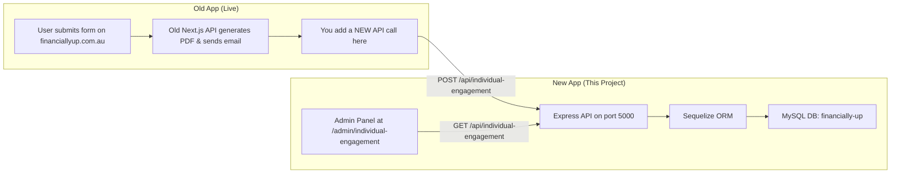

# Backend Roadmap: Financially Up Server

## Understanding of Scope

I fully understand the architecture. Here is what's happening:



**In short:**

1. The **Old App** (live at `financiallyup.com.au`, local at `localhost:3001`) has forms that users fill out. Its API already generates PDFs and sends emails.
2. You will add **one extra API call** inside the Old App's backend code so that when a form is submitted, it also sends the data to the **New App's Express API**.
3. The **New App** (this project, `localhost:3000` for frontend, `localhost:5000` for backend) stores the data in MySQL and displays it in the admin table we already built.
4. This is a **temporary bridge** until the New App has its own forms.

---

## Folder Structure

Everything lives inside `server/` at the project root. Here is exactly what will be created and why:

```
server/
├── package.json              # Separate deps for backend (express, sequelize, mysql2, cors, dotenv)
├── .env.development          # Dev environment variables (localhost URLs, DB creds)
├── .env.production           # Prod environment variables (live URLs, DB creds)
├── app.js                    # Express app setup (middleware, CORS, routes registration)
├── index.js                  # Server entry point (starts Express on port 5000)
│
├── config/
│   └── database.js           # Sequelize instance & DB connection config (reads from .env)
│
├── models/
│   ├── index.js              # Model registry - imports all models, runs associations
│   └── IndividualEngagement.js  # Sequelize model for the individual_engagements table
│
├── routes/
│   └── individualEngagement.routes.js  # Express router: GET (list/filter), POST (create), PUT (update status), DELETE
│
├── controllers/
│   └── individualEngagement.controller.js  # Business logic: handles request, calls model, returns response
│
├── middleware/
│   └── errorHandler.js       # Global error handler middleware
│
└── utils/
    └── apiResponse.js        # Standardized API response helper (success/error format)
```

### Why each file exists

| File                                             | Purpose                                                                                                                                                                                                                                                          |
| ------------------------------------------------ | ---------------------------------------------------------------------------------------------------------------------------------------------------------------------------------------------------------------------------------------------------------------- |
| `package.json`                                   | Isolates backend dependencies from the Next.js frontend                                                                                                                                                                                                          |
| `.env.development`                               | Stores local dev config: DB host/user/pass, old app URL (`localhost:3001`), new app URL (`localhost:3000`)                                                                                                                                                       |
| `.env.production`                                | Stores live config: production DB creds, old app URL (`financiallyup.com.au`), new app API URL                                                                                                                                                                   |
| `app.js`                                         | Creates the Express app, registers CORS (allowing the Old App & Admin Panel to call it), adds JSON parsing, mounts routes                                                                                                                                        |
| `index.js`                                       | Boots the server: loads env vars, syncs DB via Sequelize, starts listening on port 5000                                                                                                                                                                          |
| `config/database.js`                             | Creates the Sequelize instance connected to your XAMPP MySQL (`financially-up` database)                                                                                                                                                                         |
| `models/IndividualEngagement.js`                 | Defines the table schema matching your [individual-engagement.json](file:///d:/xampp/htdocs/myProjects/nextjs/financially-up-new/financially-up/agent-data/forms-field/individual-engagement.json) - all 43 fields plus `id`, `status`, `createdAt`, `updatedAt` |
| `models/index.js`                                | Central model registry. As you add more forms (Entity Engagement, Medicare, etc.), each model gets imported here                                                                                                                                                 |
| `routes/individualEngagement.routes.js`          | Defines REST endpoints: `GET /`, `GET /:id`, `POST /`, `PUT /:id`, `DELETE /:id`                                                                                                                                                                                 |
| `controllers/individualEngagement.controller.js` | The actual logic: validate input, create/read/update/delete records, handle pagination & status filtering                                                                                                                                                        |
| `middleware/errorHandler.js`                     | Catches unhandled errors and returns clean JSON responses instead of crashing                                                                                                                                                                                    |
| `utils/apiResponse.js`                           | Helper to ensure every API response follows the same `{ success, message, data }` format                                                                                                                                                                         |

---

## Database Table: `individual_engagements`

Sequelize will auto-create this table using `sequelize.sync()`. The columns come directly from your JSON spec:

| Column                    | DB Type                          | Notes                                        |
| ------------------------- | -------------------------------- | -------------------------------------------- |
| `id`                      | INTEGER (AUTO_INCREMENT, PK)     | Auto-generated primary key                   |
| `FirstName`               | VARCHAR(255)                     |                                              |
| `LastName`                | VARCHAR(255)                     |                                              |
| `VisaStatus`              | VARCHAR(255)                     |                                              |
| `Occupation`              | VARCHAR(255)                     |                                              |
| `dob`                     | VARCHAR(255)                     | Date of birth as string                      |
| `Spouse`                  | VARCHAR(255)                     | Yes/No flag                                  |
| `SpouseFname`             | VARCHAR(255)                     |                                              |
| `SpouseLname`             | VARCHAR(255)                     |                                              |
| `NoOfDependants`          | VARCHAR(255)                     |                                              |
| `SpouseIncome`            | DECIMAL(10,2)                    | Number type from your spec                   |
| `housenumber`             | VARCHAR(255)                     | Residential address part                     |
| `street`                  | VARCHAR(255)                     |                                              |
| `housenumber2`            | VARCHAR(255)                     | Postal address part                          |
| `street2`                 | VARCHAR(255)                     |                                              |
| `email`                   | VARCHAR(255)                     |                                              |
| `PhoneNumber`             | VARCHAR(255)                     |                                              |
| `residentialAddressMap`   | TEXT                             | Google Maps embed or full address            |
| `Residential_Address`     | TEXT                             |                                              |
| `suburb`                  | VARCHAR(255)                     |                                              |
| `postcode`                | VARCHAR(20)                      |                                              |
| `state`                   | VARCHAR(100)                     |                                              |
| `suburb2`                 | VARCHAR(255)                     |                                              |
| `postcode2`               | VARCHAR(20)                      |                                              |
| `state2`                  | VARCHAR(100)                     |                                              |
| `postalAddressMap`        | TEXT                             |                                              |
| `PostalAddress`           | TEXT                             |                                              |
| `address_PostalCheckbox`  | VARCHAR(255)                     |                                              |
| `suburb_PostalCheckbox`   | VARCHAR(255)                     |                                              |
| `postcode_PostalCheckbox` | VARCHAR(20)                      |                                              |
| `state_PostalCheckbox`    | VARCHAR(100)                     |                                              |
| `TFN`                     | VARCHAR(50)                      | Tax File Number                              |
| `ABN`                     | VARCHAR(50)                      | Australian Business Number                   |
| `NameOfAccount`           | VARCHAR(255)                     | Bank details                                 |
| `BSB`                     | VARCHAR(20)                      |                                              |
| `AccountNumber`           | VARCHAR(50)                      |                                              |
| `suburb_Step3`            | VARCHAR(255)                     |                                              |
| `postcode_Step3`          | VARCHAR(20)                      |                                              |
| `state_step3`             | VARCHAR(100)                     |                                              |
| `Terms_Conditions`        | VARCHAR(10)                      | Accepted/Not accepted                        |
| `ClientName`              | VARCHAR(255)                     |                                              |
| `signature`               | TEXT                             | Base64 or URL                                |
| `formType`                | VARCHAR(100)                     | e.g. "individual-engagement"                 |
| `proofOfID`               | JSON                             | Array of file paths/URLs                     |
| `status`                  | VARCHAR(50), DEFAULT "New Query" | **Added by us** - tracks the workflow status |
| `createdAt`               | DATETIME                         | Sequelize auto-managed                       |
| `updatedAt`               | DATETIME                         | Sequelize auto-managed                       |

---

## API Endpoints

Base URL: `http://localhost:5000/api/individual-engagement`

| Method        | Endpoint                                                      | Purpose                                       | Who calls it |
| ------------- | ------------------------------------------------------------- | --------------------------------------------- | ------------ |
| `POST /`      | Create new engagement                                         | **Old App** calls this when user submits form |
| `GET /`       | List all engagements (with pagination, status filter, search) | **Admin Panel** (New App frontend)            |
| `GET /:id`    | Get single engagement details                                 | **Admin Panel**                               |
| `PUT /:id`    | Update engagement (change status, edit fields)                | **Admin Panel** (Approve/Edit actions)        |
| `DELETE /:id` | Soft delete or hard delete an engagement                      | **Admin Panel**                               |

---

## How the Old App Will Send Data

Once the server is running, you just need to add **one `fetch` call** in the Old App's existing API route. Here's exactly what you'd paste:

```javascript
// Inside the Old App's API route (after PDF generation & email sending)
// Add this code to send form data to the New App's backend

const NEW_APP_API = process.env.NEW_APP_API_URL || "http://localhost:5000";

try {
  await fetch(`${NEW_APP_API}/api/individual-engagement`, {
    method: "POST",
    headers: { "Content-Type": "application/json" },
    body: JSON.stringify(formData), // The same form data object
  });
} catch (error) {
  console.error("Failed to sync with new app:", error);
  // Don't block the old app flow - this is just syncing
}
```

> [!IMPORTANT]
> You'll add a `NEW_APP_API_URL` env variable to the **Old App's** `.env` file:
>
> - Development: `NEW_APP_API_URL=http://localhost:5000`
> - Production: `NEW_APP_API_URL=https://your-production-api-url.com`

---

## Environment Files

### `.env.development`

```env
# Server
PORT=5000
NODE_ENV=development

# Database (XAMPP MySQL)
DB_HOST=localhost
DB_PORT=3306
DB_USER=root
DB_PASSWORD=
DB_NAME=financially-up

# App URLs
NEW_APP_URL=http://localhost:3000
OLD_APP_URL=http://localhost:3001

# CORS - origins allowed to call this API
CORS_ORIGINS=http://localhost:3000,http://localhost:3001
```

### `.env.production`

```env
# Server
PORT=5000
NODE_ENV=production

# Database
DB_HOST=localhost
DB_PORT=3306
DB_USER=root
DB_PASSWORD=YOUR_PRODUCTION_DB_PASSWORD
DB_NAME=financially-up

# App URLs
NEW_APP_URL=https://YOUR_PRODUCTION_URL
OLD_APP_URL=https://financiallyup.com.au

# CORS
CORS_ORIGINS=https://YOUR_PRODUCTION_URL,https://financiallyup.com.au
```

---

## Open Questions

> [!IMPORTANT]
> **Production API URL**: You mentioned you already have a domain/URL for the new app's production deployment. What is it? I'll put it in `.env.production`.

> [!NOTE]
> **PDF Storage**: When the Old App generates a PDF, should we also store the PDF file URL/path in the `individual_engagements` table? I can add a `pdfUrl` column for this. Currently the mock data has `hasPdf` and `hasId` boolean flags - we can upgrade these to actual URL fields.

---

## Execution Order

Once you approve this plan, I will execute in this order:

1. Initialize `server/package.json` and install dependencies (`express`, `sequelize`, `mysql2`, `cors`, `dotenv`, `helmet`)
2. Create `.env.development` and `.env.production`
3. Create `config/database.js` (Sequelize connection)
4. Create `models/IndividualEngagement.js` (table schema)
5. Create `models/index.js` (model registry)
6. Create `utils/apiResponse.js` and `middleware/errorHandler.js`
7. Create `controllers/individualEngagement.controller.js`
8. Create `routes/individualEngagement.routes.js`
9. Create `app.js` and `index.js`
10. Test: Start the server, verify DB table is created, test POST and GET endpoints
11. Connect the admin panel frontend to fetch real data from the API (replacing mock data)

---

## Verification Plan

### Automated

```bash
cd server
npm start
# Server should log: "Connected to MySQL" and "Server running on port 5000"
```

### Manual

- `POST http://localhost:5000/api/individual-engagement` with sample JSON → should create a row in MySQL
- `GET http://localhost:5000/api/individual-engagement` → should return the created row
- Check phpMyAdmin → `financially-up` DB should have `individual_engagements` table with all columns
