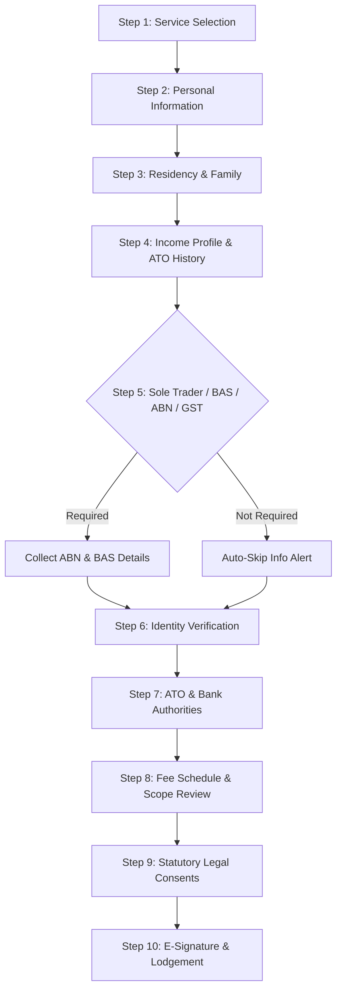

# 📋 Individual Client Engagement Form — Complete Field Map & Logic Specification

> **Official Documentation for Financially Up Clients & System Administrators**  
> *Version:* 2.5  
> *Portal Route:* `/resources/engagement-forms/individual-engagement-form`  
> *Compliance:* Tax Agent Services Act 2009, Privacy Act 1988, ATO Regulatory Framework  

---

## 📌 Executive Summary

The **Individual Client Engagement Form** is a 10-step guided onboarding wizard designed for Australian individual taxpayers. It collects all required identity, tax residency, income source, sole trader business, ATO authority, and legal consent data needed for a registered tax agent to legally represent and lodge tax returns for a client.

### Summary Statistics

| Metric | Count | Details |
| :--- | :---: | :--- |
| **Total Steps** | **10** | Guided multi-step onboarding wizard |
| **Total Form Fields** | **52+** | Input, Select, Radio, Checkbox, DatePicker, Upload, E-Sign |
| **Conditional Field Sections** | **12** | Dynamic questions dependent on user choices |
| **Mandatory Statutory Consents** | **4** | ATO Authority, ABR Access, TFN Security, Terms Consent |

---

## 🔄 Form Flow & Step Overview

---

# 📑 Step-by-Step Complete Field & Option Directory

---

## 1️⃣ Step 1: Service Selection
**Short Title:** `Services` | **Full Title:** `Service Selection`  
**Purpose:** Collect taxation, advisory, and compliance service requirements, and identify if business entities are involved.

### Fields Breakdown

| Field Name / ID | Type | Label | Options / Values | Validation Rules | Dependent Logic |
| :--- | :--- | :--- | :--- | :--- | :--- |
| `services` | Multi-Select Checkbox Group | *What services do you require?* | 13 Service Options (see below) | **Required** (At least 1 selected) | Controls Step 5 visibility & Step 8 fee calculations |
| `entityService` | Radio Cards | *Does the service relate to an entity (Company, Trust, etc.)?* | `No` (Individual Only) `Yes` (Relates to Entity) `Unsure` (Need Advice) | **Required** | If `Yes`, shows **Linked Entity Engagement Notice Alert** |

#### Available Options for `services`:
1. `Individual Tax Return` — Standard income tax return filing for Australian residents
2. `Prior-Year Return` — Overdue or unfiled tax returns for past financial years
3. `Amendment` — Correct or update previously lodged tax returns with ATO
4. `Rental Property` — Income, interest, depreciation, and deductions for investment properties
5. `Capital Gains` — Calculations for property sales, shares, investments, or assets
6. `Cryptocurrency` — Crypto trading, staking, mining, and capital gain reporting
7. `Foreign Income / Residency` — Overseas employment, residency status, and foreign tax credits
8. `Tax Planning` — Pre-EOFY tax minimization and legal tax structuring advice
9. `ATO Matter` — Representation for ATO reviews, audits, penalties, or payment plans
10. `Sole Trader BAS` — Quarterly or annual Business Activity Statements for sole traders
11. `ABN Application` — Australian Business Number application and ATO setup
12. `GST Registration` — Goods and Services Tax registration and reporting advice
13. `Other` — Custom accounting or taxation advisory request

---

## 2️⃣ Step 2: Personal Information
**Short Title:** `Personal` | **Full Title:** `Personal Details`  
**Purpose:** Establish legal identity, contact details, Australian residential address, occupation, and Tax File Number (TFN).

### Fields Breakdown

| Field Name / ID | Type | Label | Options / Values | Validation Rules | Dependent Logic |
| :--- | :--- | :--- | :--- | :--- | :--- |
| `fullName` | Text Input | *Full Legal Name* | Free Text | **Required** | Pre-fills Signer Name in Step 10 & Schedule in Step 8 |
| `dateOfBirth` | DatePicker | *Date of Birth* | Calendar Date (`DD/MM/YYYY`) | **Required** | ATO Identity Check |
| `hasPreviousName` | Radio Group | *Have you ever been known by another name?* | `No`, `Yes` | Optional | If `Yes`, reveals `previousNames` field |
| `previousNames` | Text Input | *Previous / Other Names* | Free Text | **Required if `hasPreviousName = Yes`** | ATO Name Matching |
| `tfnStatus` | Radio Group Grid | *TFN Provision Options* | `Provided`, `Applied`, `Exempt`, `Later` | Default: `Provided` | If `Provided`, shows `tfn` input. If not, shows `tfnExplanation` |
| `tfn` | Text Input (Masked) | *9-Digit Tax File Number* | 9-Digit Numeric (`123 456 789`) | **Required if `tfnStatus = Provided`** (Pattern: `^\d{3}\s?\d{3}\s?\d{3}$`) | Strictly Encrypted under Privacy Act |
| `tfnExplanation` | Text Area | *Explanation for TFN Status* | Free Text | **Required if `tfnStatus != Provided`** | Notes for ATO lodgement |
| `birthCity` | Text Input | *City / Town of Birth* | Free Text | Optional | - |
| `birthCountry` | Select (Searchable) | *Country of Birth* | 15+ World Countries List | **Required** | ATO DVS Verification |
| `mobile` | Text Input | *Mobile Phone Number* | Australian Mobile Format | **Required** (Pattern: `^(?:\+61\|0)4\d{8}$`) | SMS Verification & Notifications |
| `email` | Text Input | *Email Address* | Email Format | **Required** (Email Type) | Primary Communication Channel |
| `address` | Text Input | *Primary Australian Residential Address* | Free Text | **Required** | ATO Street Address Record |
| `occupation` | Text Input | *Main Occupation / Job Title* | Free Text | **Required** | Determines Work Deduction Eligibility |
| `employmentStatus` | Select Dropdown | *Employment Status* | `Full-Time`, `Part-Time`, `Casual`, `Self-Employed`, `Retired`, `Unemployed`, `Student` | **Required** | Determines tax offset eligibility |
| `about` | Text Area | *Tell us briefly about your tax situation* | Free Text (Max 500 chars) | Optional | Special notes for accountant |

---

## 3️⃣ Step 3: Residency & Family Profile
**Short Title:** `Residency` | **Full Title:** `Residency & Family`  
**Purpose:** Establish Australian tax residency status, visa category, spouse income, and dependant children count.

### Fields Breakdown

| Field Name / ID | Type | Label | Options / Values | Validation Rules | Dependent Logic |
| :--- | :--- | :--- | :--- | :--- | :--- |
| `isAustralianCitizen` | Radio Group | *Are you an Australian citizen?* | `Yes`, `No` | **Required** | If `No`, reveals Citizenship & Visa fields |
| `citizenshipCountry` | Text Input | *Country of Citizenship* | Free Text | **Required if `isAustralianCitizen = No`** | Tax treaty evaluation |
| `visaStatus` | Select Dropdown | *Visa Status* | 7 Visa Categories (PR, 482, 417, 500, 820, Tourist, Other) | **Required if `isAustralianCitizen = No`** | Working holiday vs PR tax rates |
| `visaSubclass` | Text Input | *Visa Subclass Number* | Subclass Code (e.g., 500, 482) | Optional | ATO Visa Verification |
| `arrivalDate` | DatePicker | *First Arrival Date in Australia* | Calendar Date (`DD/MM/YYYY`) | Optional | Part-year tax residency calculation |
| `taxResidency` | Radio Cards | *Australian Tax Residency Status* | `Australian Resident`, `Foreign Resident`, `Became Resident`, `Ceased Residence`, `Unsure` | **Required** | If `Became`, `Ceased`, or `Unsure`, triggers **Residency Review Alert** |
| `hasSpouse` | Radio Group | *Did you have a spouse / de facto partner?* | `No`, `Yes` | **Required** | If `Yes`, reveals Spouse Details section |
| `spouseName` | Text Input | *Spouse Full Name* | Free Text | **Required if `hasSpouse = Yes`** | ATO Spouse Income Section |
| `spouseDob` | DatePicker | *Spouse Date of Birth* | Calendar Date (`DD/MM/YYYY`) | **Required if `hasSpouse = Yes`** | ATO Matching |
| `spouseIncome` | Currency InputNumber | *Spouse Taxable Income ($)* | Numeric Currency | Optional | Medicare Levy Surcharge calculation |
| `prepareSpouseReturn` | Radio Group | *Prepare spouse tax return as well?* | `Yes`, `No` | Optional | Triggers secondary engagement offer |
| `hasDependants` | Radio Group | *Did you have dependent children?* | `No`, `Yes` | **Required** | If `Yes`, reveals Dependant Count input |
| `dependantCount` | Numeric Input | *Number of Dependent Children* | Integer (Min 1, Max 15) | **Required if `hasDependants = Yes`** | Family Tax Benefit & Medicare Offsets |

---

## 4️⃣ Step 4: Income Profile & ATO History
**Short Title:** `Income` | **Full Title:** `Income & Tax Profile`  
**Purpose:** Identify all income streams, previous accounting firm details, and existing ATO debts or audits.

### Fields Breakdown

| Field Name / ID | Type | Label | Options / Values | Validation Rules | Dependent Logic |
| :--- | :--- | :--- | :--- | :--- | :--- |
| `incomeActivities` | Multi-Select Checkboxes | *Which income sources apply to your tax return?* | 12 Income Stream Options (see below) | **Required** (At least 1 selected) | Guides accountant checklist |
| `hadPreviousAccountant` | Radio Group | *Did you use a previous tax agent?* | `No`, `Yes` | **Required** | If `Yes`, reveals Previous Advisor fields |
| `previousFirm` | Text Input | *Previous Accounting Firm Name* | Free Text | **Required if `hadPreviousAccountant = Yes`** | Professional Ethical Letter |
| `authorisePreviousAdvisor` | Radio Group | *Authorise Ethical Clearance Contact?* | `Authorise`, `Do Not Authorise` | Optional | Accounting Code of Ethics |
| `reasonForChange` | Text Area | *Reason for Changing Tax Accountants* | Free Text | **Required if `hadPreviousAccountant = Yes`** | Client onboarding review |
| `atoIssues` | Radio Group | *Do you have existing ATO debts, audits, or disputes?* | `No`, `Yes`, `Unsure` | **Required** | If `Yes` or `Unsure`, triggers **Priority ATO Review Alert** and reveals ATO Debt inputs |
| `atoExplanation` | Text Area | *Describe the ATO Matter or Debt* | Free Text | **Required if `atoIssues = Yes/Unsure`** | ATO Payment Plan setup |
| `noticeDate` | DatePicker | *ATO Notice Date* | Calendar Date | Optional | Compliance timeline tracking |
| `dueDate` | DatePicker | *ATO Due Date* | Calendar Date | Optional | Payment plan deadline |
| `atoDocuments` | File Upload | *Upload ATO Letters / Notices* | PDF, JPG, PNG (Max 3 files) | Optional | Document verification |

#### Available Options for `incomeActivities`:
1. `Salary/Wages` — PAYG Income Statement from employers
2. `Government Payments` — Centrelink allowances / pensions
3. `Interest` — Bank account interest income
4. `Dividends/Funds` — Share dividends & managed fund distributions
5. `Rental Property` — Investment property rental income & deductions
6. `Capital Gains` — Property, shares, or asset sales (CGT)
7. `Cryptocurrency` — Crypto trading, staking, or mining
8. `Foreign Income/Assets` — Overseas employment, pension, or foreign assets
9. `Super/Pension` — Superannuation lump sum or income streams
10. `Employee Shares` — Employee Share Schemes (ESS)
11. `Sole Trader/Contractor Income` — Sole Trader, contractor, or subcontractor income
12. `Other` — Other income or deduction matters

---

## 5️⃣ Step 5: Sole Trader BAS, ABN & GST
**Short Title:** `BAS / GST` | **Full Title:** `Sole Trader BAS & GST`  
**Purpose:** Collect Business Activity Statement parameters, ABN application data, and GST accounting method setup.

> ℹ️ **Dynamic Skip Rule:** If the user did NOT select `Sole Trader BAS`, `ABN Application`, or `GST Registration` in Step 1, Step 5 automatically displays a friendly **"Step 5 Not Required"** notification card allowing instant continuation.

### Fields Breakdown

#### A. Sole Trader BAS Section (Shown if `Sole Trader BAS` selected in Step 1)
| Field Name / ID | Type | Label | Options / Values | Validation Rules |
| :--- | :--- | :--- | :--- | :--- |
| `existingAbn` | Text Input (Mono) | *11-Digit Sole Trader ABN* | 11 Digits (`11 222 333 444`) | **Required** (Pattern: `^\d{2}\s?\d{3}\s?\d{3}\s?\d{3}$`) |
| `reportingFrequency` | Select Dropdown | *BAS Reporting Frequency* | `Quarterly`, `Monthly`, `Annual` | **Required** |
| `gstStatus` | Radio Group | *GST Registration Status* | `Registered`, `Not Registered` | **Required** |
| `overdueBas` | Radio Group | *Do you have overdue BAS?* | `No`, `Yes` | **Required** |
| `hasPayroll` | Radio Group | *PAYG Withholding / Employees?* | `No`, `Yes` | Optional |
| `basScope` | Multi-Select Checkboxes | *Required BAS Work Scope* | `Prepare & Lodge`, `Review GST`, `Bookkeeping Cleanup`, `Lodge Only` | Optional |

#### B. ABN Application Section (Shown if `ABN Application` selected in Step 1)
| Field Name / ID | Type | Label | Options / Values | Validation Rules |
| :--- | :--- | :--- | :--- | :--- |
| `businessStartDate` | DatePicker | *Proposed Business Start Date* | Calendar Date (`DD/MM/YYYY`) | **Required** |
| `businessActivity` | Text Input | *Main Business Activity* | Free Text (e.g. IT Consulting, Plumbing) | **Required** |
| `expectedTurnover` | Currency InputNumber | *Estimated Annual Business Turnover ($)* | Numeric Currency | **Required** |
| `registerGST` | Radio Group | *Register for GST with ABN?* | `Yes`, `No` | Optional |

#### C. GST Registration Setup Section (Shown if `GST Registration` selected in Step 1)
| Field Name / ID | Type | Label | Options / Values | Validation Rules |
| :--- | :--- | :--- | :--- | :--- |
| `accountingMethod` | Radio Group | *GST Accounting Basis* | `Cash` (Most Common), `Non-Cash` (Accruals) | **Required** |
| `gstRegistrationType` | Radio Group | *Registration Requirement* | `Compulsory` (Turnover ≥ $75k), `Voluntary` (Turnover < $75k) | Optional |

---

## 6️⃣ Step 6: Identity Verification
**Short Title:** `Identity` | **Full Title:** `ID Verification`  
**Purpose:** Satisfy Anti-Money Laundering (AML) and Tax Practitioner Board (TPB) client verification rules.

### Fields Breakdown

| Field Name / ID | Type | Label | Options / Values | Validation Rules | Dependent Logic |
| :--- | :--- | :--- | :--- | :--- | :--- |
| `identityMethod` | Radio Cards Grid | *Select Preferred Identity Verification Method* | 5 Verification Options (see below) | **Required** | Controls document upload vs explanation box |
| `primaryId` | File Upload | *Primary Photo ID (License/Passport)* | PDF, JPG, PNG (Max 1 file) | **Required if `identityMethod = Upload ID / Electronic`** | TPB Primary ID Evidence |
| `supportingId` | File Upload | *Supporting ID (Medicare/Utility Bill)* | PDF, JPG, PNG (Max 1 file) | **Required if `identityMethod = Upload ID / Electronic`** | TPB Secondary Evidence |
| `noPhotoIdReason` | Text Area | *Reason for No Photo ID* | Free Text | **Required if `identityMethod = No Photo ID`** | Alternative ID Exception |

#### Verification Options for `identityMethod`:
1. `Upload ID` — Upload Driver's License or Passport (Quickest & Most Popular)
2. `Electronic Verification` — Instant online check via ATO/DVS database
3. `Live Video` — Schedule a brief video verification call with our accounting team
4. `In Person` — Bring original physical documents to our North Sydney head office
5. `No Photo ID` — Alternative secondary identity evidence process

---

## 7️⃣ Step 7: Representative & Bank Authorities
**Short Title:** `Authorities` | **Full Title:** `ATO & Bank Authorities`  
**Purpose:** Nominate tax refund bank accounts and sign statutory ATO/ABR Tax Agent Authorization.

### Fields Breakdown

| Field Name / ID | Type | Label | Options / Values | Validation Rules | Dependent Logic |
| :--- | :--- | :--- | :--- | :--- | :--- |
| `isSelf` | Radio Group | *Completing form for yourself?* | `Yes` (I am client), `No` (Representative/POA) | Default: `Yes` | If `No`, reveals Representative Details |
| `repName` | Text Input | *Representative Full Name* | Free Text | **Required if `isSelf = No`** | Legal Representative |
| `relationship` | Select Dropdown | *Legal Relationship to Client* | `Parent / Guardian`, `Power of Attorney`, `Executor`, `Other Representative` | **Required if `isSelf = No`** | Legal Standing |
| `authorityDoc` | File Upload | *Upload Legal Authority Document* | PDF, JPG, PNG (Max 1 file) | **Required if `isSelf = No`** | POA Evidence |
| `needBank` | Radio Group | *Nominate bank account for tax refunds?* | `Yes`, `No` | Default: `Yes` | If `Yes`, reveals Bank Account inputs |
| `accountName` | Text Input | *Account Name* | Free Text (e.g., John Smith) | **Required if `needBank = Yes`** | Direct Credit Record |
| `bsb` | Text Input (Mono) | *6-Digit BSB* | 6 Numeric Digits (`000-000`) | **Required if `needBank = Yes`** (Pattern: `^\d{3}-?\d{3}$`) | Banking BSB |
| `accountNumber` | Text Input (Mono) | *Account Number* | Account Digits | **Required if `needBank = Yes`** | Account Number |
| `confirmOwnership` | Checkbox | *Confirm bank account ownership* | Checked / Unchecked | **Mandatory Check if `needBank = Yes`** | Anti-Fraud Confirmation |
| `atoAuthority` | Checkbox | *ATO Tax Agent Authority* | Checked / Unchecked | **Mandatory Statutory Check** | TPB Client Authority |
| `abrAuthority` | Checkbox | *ABR Access Authority* | Checked / Unchecked | **Mandatory Check if Sole Trader / ABN selected** | ABR Data Access |

---

## 8️⃣ Step 8: Scope Review & Fee Schedule
**Short Title:** `Schedule` | **Full Title:** `Fee Schedule`  
**Purpose:** Display dynamically calculated fee schedule and mandatory read-only Engagement Schedule Modal.

### Fields & Controls Breakdown

| Control / Element | Type | Description | Inclusions & Scope |
| :--- | :--- | :--- | :--- |
| `Engagement Schedule v2.1` | Modal Viewer Button | Opens full read-only legal Engagement Schedule document | Scope of works, excluded services, payment terms |
| `feeRows` | Dynamic Data Table | Renders itemized fees for all services selected in Step 1 | Service name, deliverable, scope, estimated fee |
| `hasOpenedSchedule` | System Validation State | Ensures client opens and reviews schedule before Step 9 | **Mandatory Step Guard** |

---

## 9️⃣ Step 9: Legal Consents & ATO Declarations
**Short Title:** `Consents` | **Full Title:** `Legal Agreements`  
**Purpose:** Mandatory statutory acceptances under Tax Agent Services Act 2009 and Privacy Act 1988.

### Fields Breakdown

| Field Name / ID | Type | Label / Statement | Validation Rules |
| :--- | :--- | :--- | :--- |
| `consentScheduleTerms` | Checkbox | **CONSENT 1:** I agree to the Engagement Schedule, Scope of Work, and Terms & Conditions. | **Mandatory Check** |
| `consentPrivacy` | Checkbox | **CONSENT 2:** I acknowledge the Privacy Collection Notice and TPB Client Statement. | **Mandatory Check** |
| `consentAtoAuthority` | Checkbox | **CONSENT 3:** I authorize Financially Up Pty Ltd (Tax Agent #25800000) to act with ATO. | **Mandatory Check** |
| `consentCloudOverseas` | Radio Group | **CONSENT 4:** Consent to cloud infrastructure & secure processing? | **Required** (`Yes` / `No`) |

---

## 🔟 Step 10: Electronic Signature & Submission
**Short Title:** `Signature` | **Full Title:** `E-Signature & Submit`  
**Purpose:** Legal execution of client engagement package under Electronic Transactions Act 1999.

### Fields Breakdown

| Field Name / ID | Type | Label | Options / Values | Validation Rules |
| :--- | :--- | :--- | :--- | :--- |
| `signerFullName` | Text Input | *Confirm Signer Full Legal Name* | Pre-filled from Step 2 | **Required** |
| `signatureType` | Radio Group | *Electronic Signature Method* | `type` (Type Signature), `draw` (Draw Signature) | Default: `type` |
| `signatureText` | Text Input | *Type Your Full Name as Signature* | Free Text | **Required if `signatureType = type`** (Renders Cursive Signature Preview) |
| `confirmSignatureBinding` | Checkbox | *Confirm Binding E-Signature* | Checked / Unchecked | **Mandatory Check** (Electronic Transactions Act 1999) |

---

# 🛠️ System Utilities & Actions

### 💾 1. Save Draft Functionality
- **Action:** Stores current step + filled form inputs in `localStorage` under `FINANCIALLY_UP_INDIVIDUAL_ENGAGEMENT_DRAFT`.
- **Auto-Recovery:** On page reload, automatically detects saved draft, restores values, jumps to saved step, and notifies user.

### 🗑️ 2. Reset Form Functionality
- **Action:** Triggers a safety confirmation modal (`Modal.confirm`).
- **Clearing Process:** Purges `localStorage`, clears form state, increments dynamic `formKey` to force clean component unmount, and resets to Step 1.
